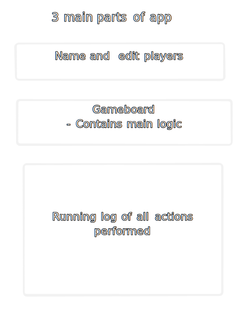

# UR-S4

> Redo URS4 - Practice - Second round of the same
> gArble

# Main Application Daigram

> Done with tldraw.com



# Noteaza

## Default Truthy Values

```js
if (isEditing) {
  playerName = <input type="text" required />;
}
```

- In the above code this will check if `isEditing` is true the other way of writing it is

```js
if (isEditing === true) { # This is redundant so above way is preferrable
    playerName = <input type="text" required />;
}
```
